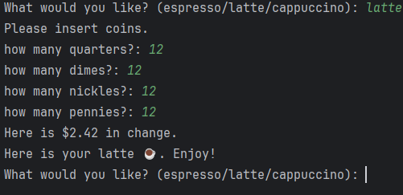

# ☕ Coffee Machine Simulation - Python Project

This is a simple command-line **Coffee Machine simulation** coded in Python. It lets users choose a drink (Espresso, Latte, or Cappuccino), insert coins, and get a virtual coffee if resources and payments are sufficient.

---

## 📽️ Demo Screenshot

---

## 📋 Features

- ✅ Choose between Espresso, Latte, or Cappuccino
- ✅ Insert coins (quarters, dimes, nickels, pennies)
- ✅ Calculates change
- ✅ Checks if ingredients are available
- ✅ Prints a report of current resources
- ✅ Allows turning off the machine (type "off")

---

## 💡 How It Works

### Commands:
- Type `espresso`, `latte`, or `cappuccino` to order
- Type `report` to see remaining ingredients and money
- Type `off` to shut down the machine

---
